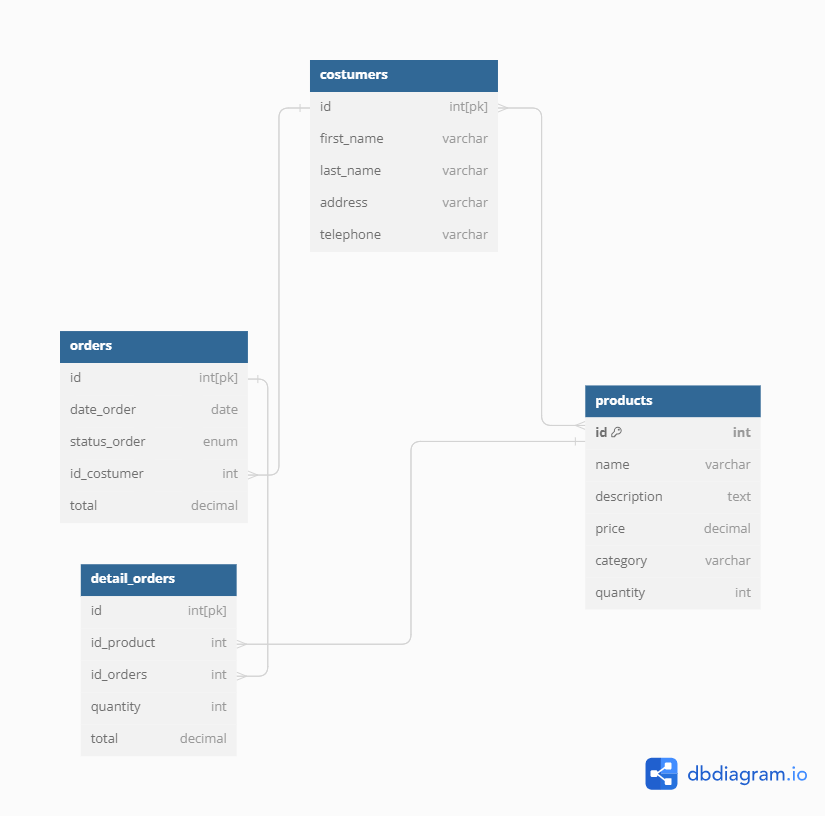

# Online Retail Database

🛒 Explore the world of online retail with this MySQL database project. This repository contains SQL queries for a comprehensive online retail database, complete with CRUD operations and an Entity-Relationship Diagram (ERD).

## Features

- **CRUD Operations:** Easily manage your online retail data with Create, Read, Update, and Delete operations.
- **ERD:** Visualize the database structure with the included Entity-Relationship Diagram.

## Database Schema

## Getting Started

1. Clone the repository: `git clone https://github.com/your-username/online-retail-database.git`
2. Import the SQL file into your MySQL database.
3. Explore and modify the queries based on your business needs.

## CRUD Operations

- **Create:** Insert new records into the database.
- **Read:** Retrieve and view data from the database.
- **Update:** Modify existing records.
- **Delete:** Remove records from the database.

Feel free to use, modify, and contribute to enhance the functionality of the online retail database.

